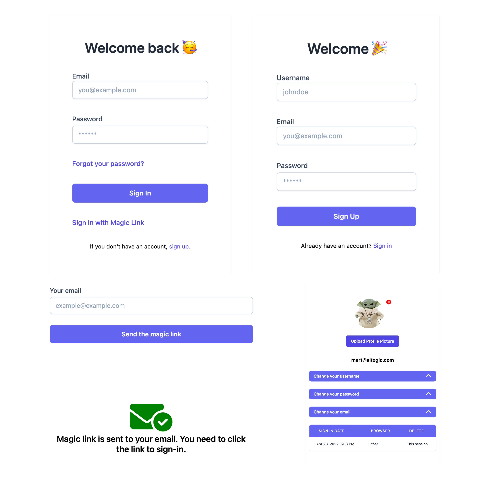
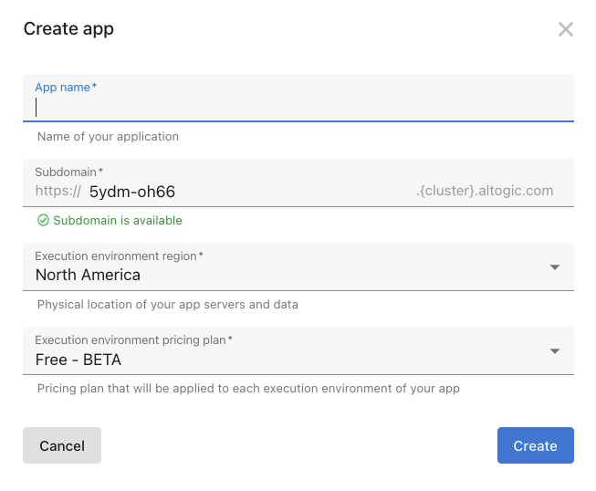

## Demo App

[Magic link authentication built with Next.js and Altogic.](https://altogic-nextjs-magic-link-auth.vercel.app/)

## Preview



## Introduction

This article will cover **magic-link authentication** basics using [Next.js](https://nextjs.org/) and [Altogic](https://www.altogic.com), a backend-as-a-service platform using its client library This authentication method allows users to sign in to the application without remembering their password.

To reduce UX friction and avoid remembering multiple passwords, some small/medium and even large organizations are moving out from the password-based authentication flow to magic authentication, depending on their risk appetite.

### Benefits

With the magic link authentication method, the user does not have to remember another password or enter it to access their account. So we can clearly understand that magic link authentication highly simplifies the login burden for users and provides a better user experience.

### Disadvantages

For that authentication method, the primary condition is that the link needs to be safe and can not be able to manipulated from outside of the application. And the links should have to be used for just a few minutes and only once. So except for these conditions, a passwordless authentication seems safer than one with a password.

You can find the written tutorial of this demo app on [our Medium blog.](https://medium.com/@mertyerekapan/39791dbb0304)

### How is the magic link authentication flow in Altogic?

1. Users who already have an account enter their email and click the "Send magic link" button.
2. An email with the magic link is sent to the specified email address by Altogic.
3. Users click on the link in the sent email.
4. Altogic redirects users to specified "Redirect URL" with an access token in the query string parameter.
5. This access token is used to get a session token, and users are directed to their profile page.

## Features

1. Sign up users
2. Magic link authentication
3. Send the email confirmation mail
4. Resend the email confirmation mail
5. Upload the profile photo
6. Change/Remove the profile photo
7. Password recovery
8. Email change
9. Password change
10. Active session management

## Installation

### Creating App in Altogic

We can create an app with the Altogic Designer really fast. To create an app via the Designer:

1. Log in to Altogic with your credentials.
2. Select New app.
3. In the App name field, enter a name for the app.
4. And click create.



---

We need `envUrl` and `clientKey` to access our environment via Altogic Client Library. `envUrl` is specific to each environment, and Altogic initially creates one environment for you when you create your app. To get the `envUrl` via the Designer:

1. Launch the Designer.
2. Click/tap on Environments at the left-bottom of the designer.
3. Click/tap name of the Environment
4. Scroll down to API BASE URL section.
5. Copy subdomain or environment url.


---

We can get the `clientKey` by clicking on the App Settings button in the left-bottom corner of the Designer and clicking on the Client library keys section.


---

Now you have got both `clientKey`and `envUrl`. Now you have to create a `.env.local` file in your root directory of the project to complete the Altogic configuration with your app:

```bash
touch .env.local
```

Copy and paste the below code to your `.env.local` file, don't forget to change <YOUR-APPLICATION-ENV-URL> and <YOUR-APPLICATION-CLIENT-KEY> values with your `envUrl` and `clientKey`.

```javascript
NEXT_PUBLIC_ALTOGIC_ENV_URL = <YOUR-APPLICATION-ENV-URL>;
NEXT_PUBLIC_ALTOGIC_CLIENT_KEY = <YOUR-APPLICATION-CLIENT-KEY>;
```

### Install the packages

Before you start to use the npx command, make sure you have NodeJS installed in your development environment. Also, installing VSCode and some extensions might be better for faster development.

💡 You can visit https://nodejs.org/en/download/ to download.

To get started, clone this project and proceed to the installation.

Install the packages:

```bash
npm install
```

Run the development server:

```bash
npm run dev
```

Open [http://localhost:3000](http://localhost:3000) with your browser to see the result.

## Learn More

To learn more about Altogic and Next.js, you can take a look at the following resources:

- [Altogic Client API Reference](https://clientapi.altogic.com/v1.2.2/modules.html) - learn about Altogic Client Library features
- [Altogic Docs](https://docs.altogic.com/) - learn about how to design your backend in Altogic
- [Next.js Documentation](https://nextjs.org/docs) - learn about Next.js features and API.

## Contribution

Your feedback and contributions are welcome! Please open a pull request for contributions.

## Youtube Video

[](https://www.youtube.com/watch?v=k4UEqFp9jFk)
