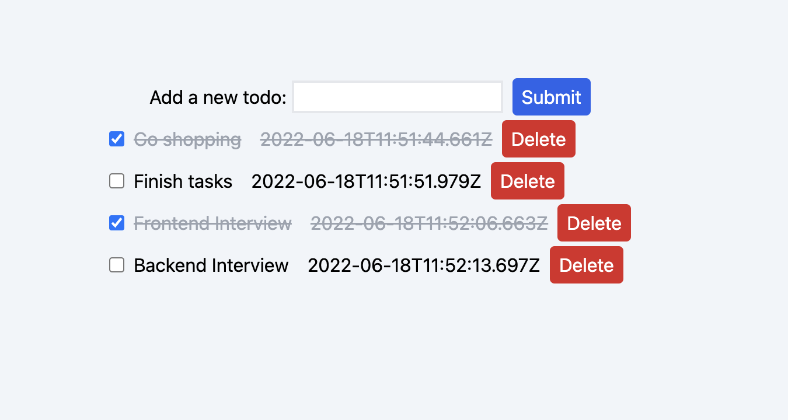
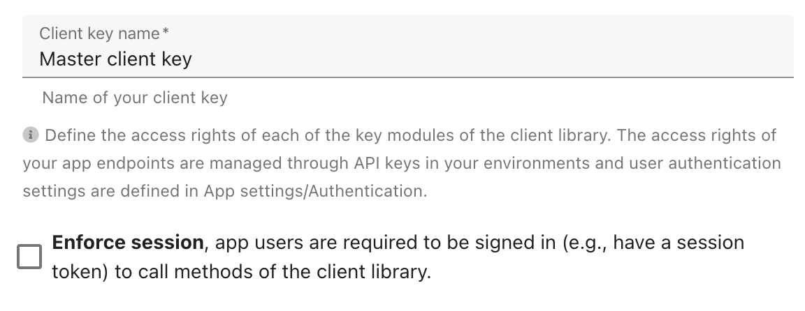

## Demo App

[Quickstart ToDo App built with Next.js, and Altogic.](https://altogic-nextjs-todo-app-quickstart.vercel.app/)

## Preview



## Introduction

This is a quickstart [Next.js](https://nextjs.org/) to-do app built with [Altogic](https://www.altogic.com), backend-as-a-service platform as the backend using its client library.

You can find the written tutorial of this demo app on [our Medium blog.](https://medium.com/altogic/quickstart-how-to-build-to-do-app-using-next-js-altogic-9c908d34177a)

## Features

1. Create a to-to
2. List all to-do(s)
3. Update the status of the to-d
4. Delete a to-do

## Installation

### Creating App in Altogic

We can create an app with the Altogic Designer really fast. To create an app via the Designer:

1. Log in to Altogic with your credentials.
2. Select New app.
3. In the App name field, enter a name for the app.
4. And click create.


---

We need `envUrl` and `clientKey` to access our environment via Altogic Client Library. `envUrl` is specific to each environment, and Altogic initially creates one environment for you when you create your app. To get the `envUrl` via the Designer:

1. Launch the Designer.
2. Click/tap on Environments at the left-bottom of the designer.
3. Click/tap name of the Environment
4. Scroll down to API BASE URL section.
5. Copy subdomain or environment url.


---

We can get the `clientKey` by clicking on the App Settings button in the left-bottom corner of the Designer and clicking on the Client library keys section.


Since we won't use any authentication user, we have to be able to send requests without session. We should remove the enforcement of the sessions from the client.

1. Click on the related client key.
2. Untick the Enforce session checkbox

## 

Now you have got both `clientKey` and `envUrl`. Now you have to create a `.env` file in your root directory of the project to complete the Altogic configuration with your app:

```bash
touch .env
```

Copy and paste the below code to your `.env` file, don't forget to change <YOUR-APPLICATION-ENV-URL> and <YOUR-APPLICATION-CLIENT-KEY> values with your `envUrl` and `clientKey`.

```javascript
NEXT_PUBLIC_ALTOGIC_ENV_URL = <YOUR-APPLICATION-ENV-URL>;
NEXT_PUBLIC_ALTOGIC_CLIENT_KEY = <YOUR-APPLICATION-CLIENT-KEY>;
```

### Install the packages

Before you start to use the npx command, make sure you have NodeJS installed in your development environment. Also, installing VSCode and some extensions might be better for faster development.

💡 You can visit https://nodejs.org/en/download/ to download.

To get started, clone this project and proceed to the installation.

Install the packages:

```bash
npm install
```

Run the development server:

```bash
npm run dev
```

Open [http://localhost:3000](http://localhost:3000) with your browser to see the result.

## Learn More

To learn more about Altogic and Next.js, you can take a look at the following resources:

- [Altogic Client API Reference](https://clientapi.altogic.com/v1.3.1/modules.html) - learn about Altogic Client Library features
- [Altogic Docs](https://docs.altogic.com/) - learn about how to design your backend in Altogic
- [Next.js Documentation](https://nextjs.org/docs/getting-started) - learn about Next.js

## Contribution

Your feedback and contributions are welcome! Please open a pull request for contributions.
