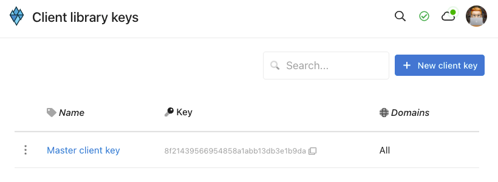

## Preview


## Introduction

This article will cover **two-factor authentication** basics using [Next.js](https://nextjs.org/), [Twilio](https://twilio.com), and [Altogic](https://www.altogic.com), a backend-as-a-service platform using its client library. This authentication method allows users to add one more security layer to their application. Many people enable their two-factor authentication settings to increase their security using their phone numbers or authentication apps for security purposes.

You can find the written tutorial of this demo app on [our Medium blog.](https://medium.com/@mertyerekapan/42770195ba5)

### How is the two-factor authentication flow in Altogic?

1. Users who already have an account need to set their phone number to enable two-factor authentication.
2. An SMS with a code is sent to the specified phone number by Altogic and Twilio.
3. Users verify their phone number by entering the code sent to their phone number.
4. Users can enable or disable the two-factor authentication setting from their profile.
5. When users try to sign in, if two-factor authentication is enabled, a code is sent to the specified phone number by Altogic and Twilio.
6. Users verify their identity by entering the code on the input on the screen.
7. If two-factor authentication is not enabled, they can sign in without this process.

## Features

1. Sign up users
2. Sign in using **two factor authentication**
3. Send the email confirmation mail
4. Resend the email confirmation mail
5. Upload the profile photo
6. Change/Remove the profile photo
7. Password recovery
8. Email change
9. Password change
10. Active session management

## Installation

### Creating App in Altogic

We can create an app with the Altogic Designer really fast. To create an app via the Designer:

1. Log in to Altogic with your credentials.
2. Select New app.
3. In the App name field, enter a name for the app.
4. And click create.


---

We need `envUrl` and `clientKey` to access our environment via Altogic Client Library. `envUrl` is specific to each environment, and Altogic initially creates one environment for you when you create your app. To get the `envUrl` via the Designer:

1. Launch the Designer.
2. Click/tap on Environments at the left-bottom of the designer.
3. Click/tap name of the Environment
4. Scroll down to API BASE URL section.
5. Copy subdomain or environment url.


---

We can get the `clientKey` by clicking on the App Settings button in the left-bottom corner of the Designer and clicking on the Client library keys section.



---

Now you have got both `clientKey`and `envUrl`. Now you have to create a `.env.local` file in your root directory of the project to complete the Altogic configuration with your app:

```bash
touch .env.local
```

Copy and paste the below code to your `.env.local` file, don't forget to change <YOUR-APPLICATION-ENV-URL> and <YOUR-APPLICATION-CLIENT-KEY> values with your `envUrl` and `clientKey`.

```javascript
NEXT_PUBLIC_ALTOGIC_ENV_URL = <YOUR-APPLICATION-ENV-URL>;
NEXT_PUBLIC_ALTOGIC_CLIENT_KEY = <YOUR-APPLICATION-CLIENT-KEY>;
```

### Install the packages

Before you start to use the npx command, make sure you have NodeJS installed in your development environment. Also, installing VSCode and some extensions might be better for faster development.

💡 You can visit https://nodejs.org/en/download/ to download.

To get started, clone this project and proceed to the installation.

Install the packages:

```bash
npm install
```

Run the development server:

```bash
npm run dev
```

Open [http://localhost:3000](http://localhost:3000) with your browser to see the result.

## Learn More

To learn more about Altogic and Next.js, you can take a look at the following resources:

- [Altogic Client API Reference](https://clientapi.altogic.com/v1.3.1/modules.html) - learn about Altogic Client Library features
- [Altogic Docs](https://docs.altogic.com/) - learn about how to design your backend in Altogic
- [Next.js Documentation](https://nextjs.org/docs) - learn about Next.js features and API.
- [Twilio Docs](https://www.twilio.com/docs) - learn about Twilio services

## Contribution

Your feedback and contributions are welcome! Please open a pull request for contributions.

## Youtube Showcase Video

[](https://www.youtube.com/watch?v=iZHgR1_W8vk)
