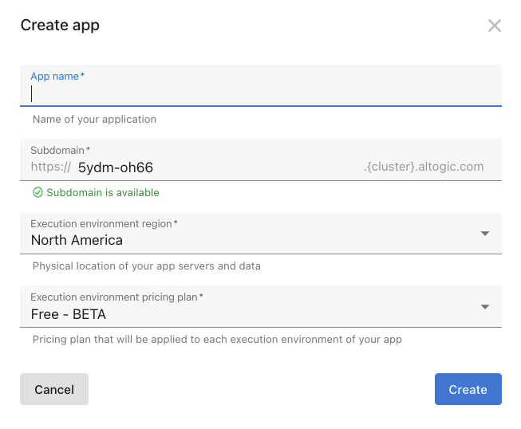
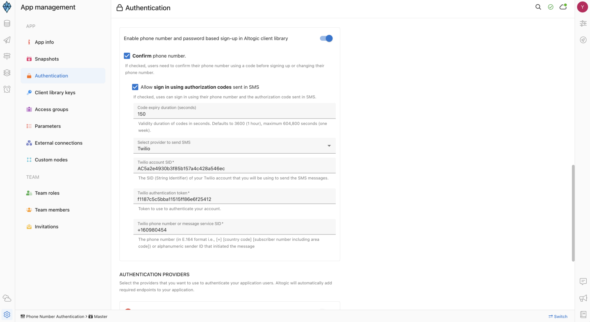

You can reach the demo [here](https://altogic-react-phone-auth.vercel.app/)

## Preview


## Introduction

This is a phone number-based authentication app using [React](https://reactjs.org/)&[Tailwind CSS](https://tailwindcss.com/docs/guides/create-react-app) and [Altogic](https://www.altogic.com), backend-as-a-service platform as the backend using its client library.

With phone number authentication, the application will send an SMS code to the user through **Twilio**. After users receive the SMS message from the provider, they can use this code to verify their phone number.

It is also possible to further set up the authentication system through other providers such as **MessageBird** and **Vonage**.

You can find the written tutorial of this demo app on our [Medium blog.](https://medium.com/altogic/how-to-build-phone-number-based-authentication-with-react-altogic-and-twilio-4776fc0c7613)

## Features

Even though our application is a phone number authentication app, it has powerful extra features and an excellent user interface, as you can see in the product review.

- Sign up with a phone number
- Sign in with a phone number
- Verify phone number by sending SMS
- Sign out from the current session
- Sign out from other sessions
- Sign out from all sessions
- Get all active sessions
- Change phone number
- Change password
- Reset password(Forgot password)
- Upload profile photo to the cloud storage
- Remove profile photo from the cloud storage

## Installation

Before installing the application, be sure you have already installed NodeJS and git in your development environment.

First, you have to clone the repository.

### Creating App in Altogic

To enable phone number authentication, we need to create an app in **Altogic**.
We can create an app with the **Altogic Designer** really fast. To create an app via the Designer:

1. Log in to Altogic with your credentials.
2. Select New app.
3. In the App name field, enter a name for the app.
4. And click create.



After creating the app, we need `envUrl` and `clientKey` to access our app via Altogic Client Library to create a web application. You can customize your subdomain, but not necessarily to do. **Altogic** automatically creates one for you, which will be your `envUrl`.


In order to get the `clientKey`, we need to enter the app and;

1. Click on **App Settings** at the left-bottom of the **Altogic Designer**
2. Click on **Client library keys** section.


We can create new `clientKey` from that page, but **Altogic** automatically creates one for you. You can copy the existing `clientKey` from the list.

Now you have got both `clientKey` and `envUrl`. Now you have to create a `.env` file in your root directory of the project to complete the Altogic configuration with your app:

```powershell
touch .env
```

Copy and paste the below code to your `.env` file. Do not forget to change `YOUR_APPLICATION_ENV_URL` and `OUR_APPLICATION_CLIENT_KEY` values with your `envUrl` and `clientKey`.

```javascript
REACT_APP_ALTOGIC_ENV_URL = YOUR_APPLICATION_ENV_URL;
REACT_APP_ALTOGIC_CLIENT_KEY = YOUR_APPLICATION_CLIENT_KEY;
```

Our Altogic Client is ready to use now! We have last remaining configuration to complete now: _Twilio_

### Twilio Integration

You need to sign in to _Twilio_ with a free/paid account. Then, you have to copy the **Account SID** and **Twilio Auth Token** variable to complete the configuration with Altogic.

💡 After signing in to the _Twilio_ account, you have to enable the phone number and password based sign up from **Altogic Designer → App Settings → Authentication → Mobile Phone Authentication → Enable phone number and password based sign up in Altogic client library.**



In the same tab, you have to enter the **Twilio Account SID** and **Twilio Authentication Token** and **Twilio Phone Number** values.

## Install the Packages

Finally we completed all configurations for Altogic Client. It is time to install the dependencies:

```powershell
npm install
```

Required dependencies are installed to your local machine. Everything is ready to start and run the project:

```powershell
npm run start
```

## Learn More

Take a look at the following resources:

- [Altogic Client API Reference](https://clientapi.altogic.com/v1.2.2/modules.html) - learn about Altogic Client Library features
- [Altogic Docs](https://docs.altogic.com/) - learn about how to design your backend in Altogic
- [React Documentation](https://reactjs.org/docs/getting-started.html) - learn about React.js features and API.
- [Tailwind Documentation](https://tailwindcss.com/docs/installation) - learn about design your app with Tailwind CSS

## Contribution

Your feedback and contributions are welcome! Please open a pull request for contributions.

## Youtube Video

[](https://www.youtube.com/watch?v=J4c4DOr39Qg)
